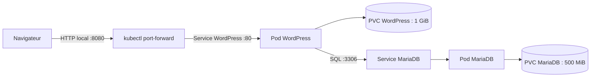
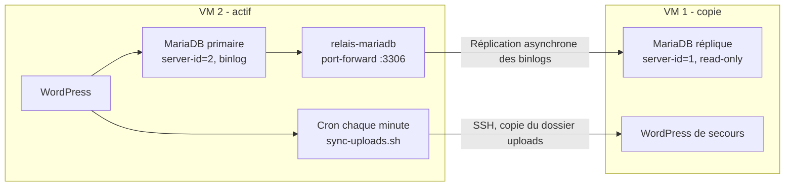

# Architecture actuelle

## Site et base de données

WordPress et MariaDB sont déployés dans le namespace `default` de Minikube, avec les releases Helm `wordpress-release` et `mariadb-release`. MariaDB est une instance standalone, pas un cluster Galera. La haute disponibilité est assurée entre deux VM en actif/passif par réplication MariaDB asynchrone, plutôt que par Galera dans un seul cluster.

Le navigateur accède au site par un `kubectl port-forward` local. Le Service WordPress envoie les requêtes au pod WordPress ; ce pod utilise son PVC pour conserver les fichiers et communique avec MariaDB via le Service interne sur le port `3306`. Le PVC MariaDB conserve les données de la base.

L’accès local se fait avec `kubectl port-forward svc/wordpress-release 8080:80`, puis `http://127.0.0.1:8080`. Le Service WordPress est de type `LoadBalancer`, avec l’adresse externe `pending` et les ports NodePort `31237` (HTTP) et `30830` (HTTPS).

## Réplication actif/passif

Le relais MariaDB et la tâche cron des uploads fonctionnent uniquement sur l’actif. `CIBLE` désigne l’adresse de la VM copie et doit être mise à jour lors d’une bascule. WordPress sur le réplica peut tenter des écritures automatiques (`wp-cron`, contrôles de santé) ; le mode `read_only` de la base copie évite ces écritures et les conflits de réplication associés à l’erreur 1062.

L’extension Alios est encore active dans WordPress, mais elle n’a pas d’effet sur l’architecture de stockage actuelle.

## État observé pendant la phase 1

- Minikube et les releases MariaDB `28.1.1` et WordPress `34.1.3` sont présents.
- Les pods MariaDB et WordPress sont `Running` et prêts `1/1`.
- Les PVC MariaDB (`500 MiB`) et WordPress (`1 GiB`) étaient `Bound`.
- Le test HTTP local sur `127.0.0.1:8080` a répondu `200`.